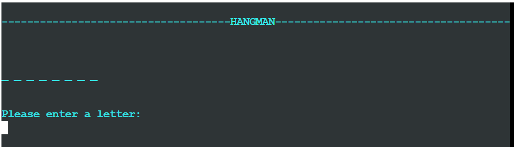
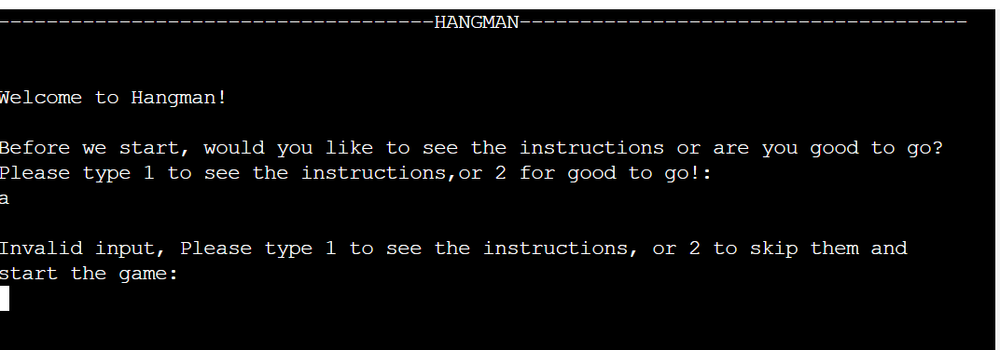

# Hangman

Hangman is a game usually played by two or more people, where one person thinks of a word while the others guess what the word is by guessing one letter at a time until the whole word is revealed.
For this project I wanted to create a version of this game that you can play against the computer rather than playing against another person.
This is done by using python to generate the word and check if the users guesses are correct, incorrect, invalid or if the user has already guessed the letter.

[Click here to go to the live website!](https://hang-the-guy.herokuapp.com/) 

## Table of contents 

1. [Plans and structure](#plans-and-structure)
2. [Color scheme](#color-scheme)
3. [Features](#features)
    - [Welcome page](#welcome-page)
    - [Instructions](#instructions)
    - [Game](#game)
    - [Losing message](#losing-message)   
    - [Winning message](#winning-message) 
    - [Colored text](#colored-text) 
    - [Clear termainal](#clear-termainal)
    - [Future features](#future-features)
4. [Testing](#testing)
    - [Python](#python)
    - [Manual Testing](#manual-testing)
    - [Bugs ](#bugs)
5. [Deployment](#deployment)
6. [Finished product](#finished-product)
7. [Credits](#credits)
    
## Plans and structure 

  

Throughout the process of making this project I decided to change a couple of things due to the time limmit i had to make the game. 

- Originally I planned to have 2 levels easy and hard so the user could choose the level of difficaulty they would like to play.
- I had also planned to have a visable image of hangman being shown so the user could see how many lives they had left until the game was over. 

I decided that these two things were not as important as all the other functions so I would like to either implement them if i have time to at the end of the process or if not I would like to impliment them in the future so I can continue to use this game with family and friends. 

Go back to [Table of contents](#table-of-contents) 

## Color scheme
I decided to add a color scheme to provide a better user experience. By showing error messages and incorrect guesses in red text and correct guesses in green text to make it clearer to the user.
- General text, Cyan ("\033[1;36;40m").
- Error messages/Wrong guesses, Red ("\033[1;31;40m").
- Correct guesses, Green ("\033[1;32;40m").

Go back to [Table of contents](#table-of-contents)

## Features 

### Welcome page
- This is the first page you see when the app loads. On this page there is a welcome messgae and a question to the user. The questions asks the user if they want to see the instructions or if they are happy to go ahead and play without seeing them. 

### Instructions 
- The instructions page explains to the user how the game is played and then asks the user if they are ready for the game.

### Game
- When the user starts the game its shows the user the length of the word they are guessing and asks the user to enter a letter.

- While the user is playing the game page also shows other things such as if there last guess was valid, correct or incorrect, how many tries the user has left, what letters the user has used so far and the letters guessed correctly in their positions within the word. 

### Losing message
- If a user runs out of guesses it will take them to a page that tells them they are out of tries, shows them what the word was and asks if they would liek to play again.

### Winning message
- <!--Add description once I have this working-->

### Colored text 
- I used three different colors for the text in this game to understand the reasons behind the colors have a look at the [Color scheme](#color-scheme).

### Clear termainal
- Between each page or turn in the game I have cleared the terminal to make it clearer for the user to read. 

### Future features
- I would like to introduce a choice of levels so the user can decide if they want to guess an easy word or a hard word.
- I would also like to add a visual image of hangman so the user can see how many tries they have left in the more traditional way. 

Go back to [Table of contents](#table-of-contents)

## Testing

### Python
Python was tested using PEP8 [PEP8 validator](http://pep8online.com/) 

The Python results came back with the following:

- 7x line too long 

- To fix this I added a "\" within the print statements to shorten the lines while keeping the same text.
However, 1 out of the 7 lines that were too long was:
reveal_word = [letter if letter in guessed_letters else "_" for letter in word]
When trying to add "\" to this line it came back with more errors as this is between brackets and not just a string.

 ~~~~~~~~~~~~~~~~~~~

### Manual Testing 

1. Would the user like to see the instructions?
 the user is asked to input either 1 for yes or 2 for no. 

 - First I tested what would happen if the user typed anything other than 1 or 2: Error message shows, results were as expected.

  

 - Next I tested what would happen if the user typed 1: Shows instructions, results were as expected.

 

 - Last I tested what would happen if the user typed 2: Game starts,results were as expected.

  

2. After reading the instructions the user is asked if they are ready to play, 1 for yes and 2 for no.

 - First I tested what would happen if the user typed anything other than 1 or 2: Error message shows, results were as expected.
 
  

 - Next I tested what would happen if the user typed 1: Game starts, results were as expected.

 

 - Last I tested what would happen if the user typed 2: User us sent back to welcome page, results were as expected.

  

3. Once game has started the user is asked to enter a letter.

 - First I tested what would happen if the user typed anything other a letter: Error message shows, results were as expected.
 
  

 - Next I tested what would happen if the user typed a valid yet incorrect guess: Try again message shows and tries are appended, results were as expected.

 

 - Then I tested what would happen if the user typed a correct guess: correct letter is put into place in the word, results were as expected.

  

 - Last I tested what would happen if the user typed a letter they had already guessed: You have already guessed that letter message shows, results were as expected.
 
  

4. At the end of the game the user is asked if they want to play again, 1 for yes 2 for no.
 
 - First I tested what would happen if the user typed anything other than 1 or 2: Error message shows, results were as expected.

  

 - Next I tested what would happen if the user typed 1: Game starts again, results were as expected.

 

 - Last I tested what would happen if the user typed 2: Goodbye message shows, results were as expected.

  

### Bugs 
1. I found that when a user guesses every letter in a word, the loop isn't ending meaning that if the user still has tries left even if they have guessed every letter it will keep asking them to enter another letter until the user runs out of tries. 

  

- fixed? 

- what did i do to fix it?

Go back to [Table of contents](#table-of-contents)

## Deployment 

There were many steps to deploying this project to Heroku:

1. If I had installed any packages to gitpod, I would need to add then to a list of requirements. 
- To do this I would have typed pip3 freeze > requirements.txt and hit enter, this would update the requirements.txt file.
- I'd need to commit and push this to github.
- Heroku will use this list to install the dependencies into the application before the project is run.
- However I didnt need to do this as I had no packages installed.
2. I went over to my Heroku dashboard and clicked on 'create a new app'.
3. I chose a name for my app, every app has to have a unique name so i couldnt call it hangman as this was already taken so i went for hang-the-guy.
4. Selected my region and clicked create app. 
5. I then went to the tab at the top of the page and clicked on settings. 
6. Some apps will include sensitive data in the gitpod workspace that isnt in the github repository because it has been deliberately protected in the gitnore.file. I didnt have any sensitive data to protact but if I had done I would have needed to create a config var to allow Heroku access to this data. 
 - To do this, I would have clicked reveal config vars.
 - Filled in the key for example: CREDS
 - Then copy and pasted the contents of that 'CREDS' file into the value field and clicked add. 
7. I added the buildpacks needed by clicking on the buildpack button.
 - Here I selected pyhton and pressed save changes.
 - Then repeated teh same process but selected nodejs this time.
 - making sure it was done in that order with python at the top and nodejs under.
8. I scrolled back up to the tab at the top and clicked deploy.
9. I selected github as the deployment method and clicked connect to github.
10. Once this is selected I then searched for my github repository name, and connected to the correct repository.
11. Then I scrolled down, here there were two options.
 - The first option being to enable automatic deployment, which means that Heroku will rebuild the app every time I pushed a change to github.
 - The other option being to manually deploy, which is the choice i went for with this project.
12. When all the code is recieved from github there is a view button that it a link to the running app, I clicked this to make sure everything was running as expected.

Go back to [Table of contents](#table-of-contents)

## Finished product

<!-- Add finished product -->

Go back to [Table of contents](#table-of-contents)

## Credits 

- [Lucid chart](https://www.lucidchart.com/pages/) - This was used to create the flow chart in the planning process for this project. 
- [random word generator](https://randomwordgenerator.com/) - I used this site to generate a list of random words.
- [code beautifier](https://codebeautify.org/python-formatter-beautifier) - Helped make the code look neat.
- [PEP8 validator](http://pep8online.com/) - was used to check the code was valid.

Go back to [Table of contents](#table-of-contents)